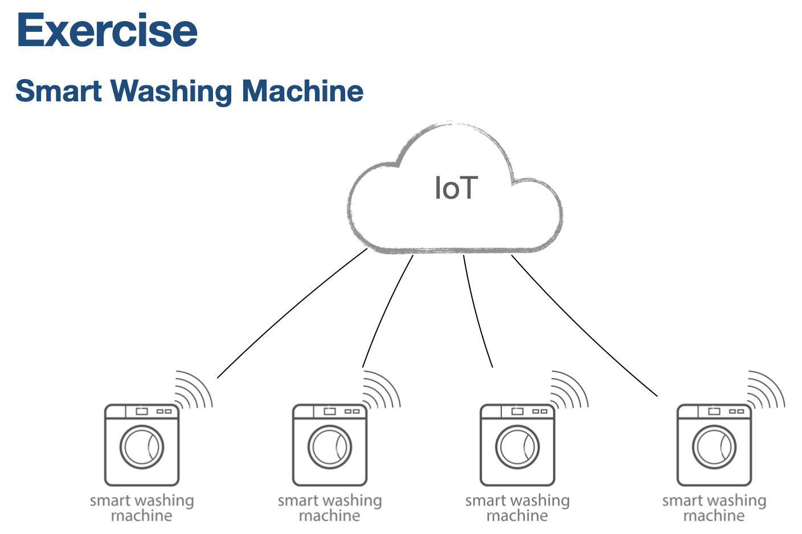

## Get hardware level operations e.g. wash_count
```
Topic: v1cdti/hw/get/6310301022/ฝาบนเครื่องซักผ้า/WSH-SN001
Payload: {
    "action"    : "get",
    "project"   : "6310301022",
    "model"     : "ฝาบนเครื่องซักผ้า",
    "serial"    : "WSH-SN001",
    "name"      : "wash_count",
    "value"     : "100"
}
```

## Get firmware version
```
Topic: v1cdti/hw/get/6310301022/ฝาบนเครื่องซักผ้า/WSH-SN001
Payload: {
    "action"    : "get",
    "project"   : "6310301022",
    "model"     : "ฝาบนเครื่องซักผ้า",
    "serial"    : "WSH-SN01",
    "name"      : "firmware version",
    "value"     : "110"
}
```

## Get manufacture id and geo-location or location placement
```
Topic: v1cdti/hw/get/6310301022/ฝาบนเครื่องซักผ้า/WSH-SN001
Payload: {
    "action"    : "get",
    "project"   : "6310301022",
    "model"     : "ฝาบนเครื่องซักผ้า",
    "serial"    : "WSH-SN01",
    "name"      : "location placement",
    "value"     : "Bangkok"
}
```

## Set geo-location or location placement
```
Topic: v1cdti/hw/set/6310301022/ฝาบนเครื่องซักผ้า/WSH-SN001
Payload: {
    "action"    : "set",
    "project"   : "6310301022",
    "model"     : "ฝาบนเครื่องซักผ้า",
    "serial"    : "WSH-SN01",
    "name"      : "geo-location",
    "value"     : "110,250"
}
```

## Monitor machine sensor
```
Topic: v1cdti/hw/monitor/6310301022/ฝาบนเครื่องซักผ้า/WSH-SN001
Payload: {
    "action"    : "monitor",
    "project"   : "6310301022",
    "model"     : "ฝาบนเครื่องซักผ้า",
    "serial"    : "WSH-SN01",
    "name"      : "Weight Sensor",
    "value"     : "10"
}
```

## Set machie status to "maint" to indicate this machine need to be maintenance.
```
Topic: v1cdti/hw/set/6310301022/ฝาบนเครื่องซักผ้า/WSH-SN001
Payload: {
    "action"    : "set",
    "project"   : "6310301022",
    "model"     : "ฝาบนเครื่องซักผ้า",
    "serial"    : "WSH-SN01",
    "name"      : "status",
    "value"     : "maint"

}
```
